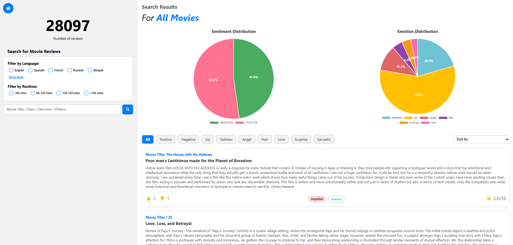

# Frontend Code
This folder contains code to build the frontend of the application.

## How to start the application:
Step 1. Navigate to `backend` folder and run:
```
npm install
node index.js
```

Step 2. Navigate to `solr-9.8.1` folder and run:
```
bin/solr start
```

Step 3. In this directory, run:
```
npm install
npm start
```

Step 4. Navigate to `localhost:3000` to access the application. 

